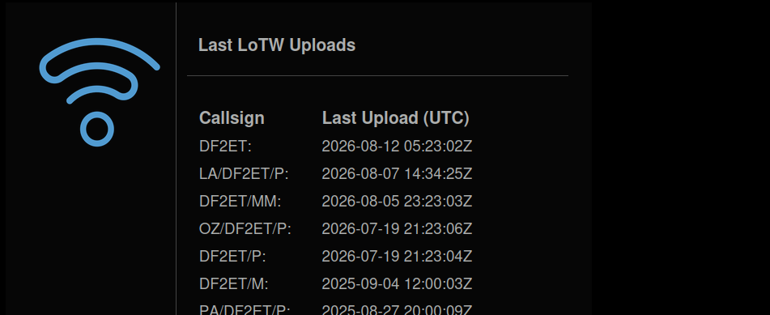

# Last-LoTW-Uploads Widget

This widget displays the date of the last (successful) uploads to LoTW and can be added to your qrz.com profile easily.

## How does it look?



## Widget configuration

- The widget is **disabled by default** and needs to be explicitly enabled by user. Widget configuration is located in `Account > Widgets` settings.
- The **URL to your widget** is displayed under the "Enabled" setting. This URL is unique for each user of the Wavelog, is generated automatically and cannot be changed.

| setting | purpose | default |
|----|----|----|
|`Enabled`|Enables the widget and reveals your personal widget URL|off|

### URL settings

Some aspects of the widget can be further configured via GET parameters appended to the URL. If some option is not supplied, the default value is used.

```text
https://[wavelog url]/index.php/widgets/lotw_upload/xxxxxxxxxx?[option0]=[value]&[option1]=[value]&[option2]=[value]
```

| option | expected value | purpose | default value |
|----|----|----|---|
|`text_size`|`1` - `6`|font size used for the text displayed in widget|1|
|`theme`|folder name of any theme installed in your Wavelog, e.g. `default` / `cyborg` / `darkly` / `cosmo` / `superhero` / `color_impaired`|appearance theme|global theme of the Wavelog instance|
|`sort`|Sort order `date` / `call`|Change sort order|Date|

### Example URL

```text
https://[wavelog url]/index.php/widgets/lotw_upload/xxxxxxxxxx?theme=dark&sort=call
```

## Usage

For embedding this widget on your website, or for example on QRZ.com, you can use the following code snippet. Do not forget to use **your** widget URL that you will find in `Account > Widgets` settings.

```html
<iframe align="top"
  frameborder="0"
  height="250"
  width="550"
  id="lotw_upload_widget"
  name="last-lotw-uploads"
  src="https://YOUR_WAVELOG_URL.com/index.php/widgets/lotw_upload/XXXXXXXXXX?theme=dark&sort=call"
  style="border-radius: 1.5rem;" width="700">
</iframe>
```
